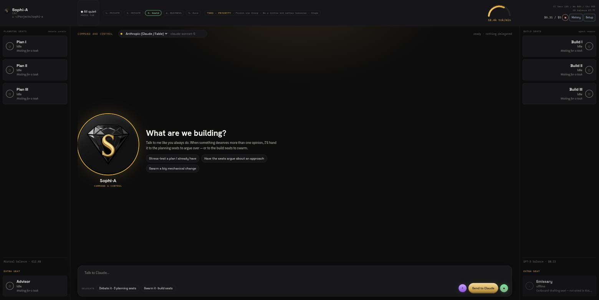

# Sophi-A

**A desktop shell that runs eight agent seats at once, where the planning seats can send a plan
to critic models from other labs before a building seat writes code.** Sophi-A is a Tauri v2 app
(Linux and Windows) with one always-on Command & Control home seat, one Advisor, three planning
seats and three building seats (real Claude Code subprocesses). Open source (MIT); bring
your own credentials, nothing is resold.

> **Sophi-A or Zofia?** Sophi-A is the predecessor of
> [Zofia](https://github.com/muad-yasin/zofia). Zofia is a smaller, Linux-only tool that
> *watches* four Claude Code terminals you open yourself and gives you one chat seat in the
> middle; it makes no network calls of its own. Sophi-A is the bigger workshop: it *owns* its
> eight seats, and its planning seats call several providers' APIs. Pick Zofia if you already work
> in terminals and want an overview; pick Sophi-A if you want the app to run the whole
> plan-then-build loop, including the multi-lab review step, and you are fine setting up the keys
> that needs.



*A screenshot of the real app: the home conversation in the center, three planning seats and the
Advisor on the left, three build seats on the right. The "Emissary" tile on the right is a
placeholder with nothing behind it yet; the app says so on the tile itself.*

## What a planning seat does

Each of the three planning seats (`plan-1..3`) runs a council chain on
[The High Council](https://github.com/muad-yasin/the-high-council-mcp) (`the-high-council` on
npm, MIT). One model drafts a plan, then critic seats from other labs review it independently,
and the draft is revised against their objections. The run ends either with every critic signing
off or with a `report.json` that names which critic objected and why. The run folder keeps the
whole exchange, so you can read the argument afterwards instead of taking a summary on trust.

The default chain (`plan-cheap`) uses Claude Sonnet to draft and revise, and five cheap-tier
critics: Qwen (via Together), GLM (Z.ai), Command (Cohere), Gemini Flash (Google) and Llama (via
OpenRouter). The planning seat's dropdown also offers `plan-fast` (two critics, no revisions) and
`plan-thorough` (one extra revision round). Grok/xAI is never used.

Nobody has measured whether this review step produces better plans or better code than a single
model working alone. Sophi-A shows you the objections; whether they help is for you to judge.

The review step is also not a lock: a building seat accepts a task directly, and a signed-off
plan only reaches a building seat when you forward it by hand.

## The GUI

The home seat is always the resting view: whichever model you talk to in the center stays in
front of you. The planning and build seats sit in fixed rails on either side; clicking one opens
its detail (the debate panel, a build seat's own task form) without hiding the center. A side
seat's controls reach *its own* agents only; it never commands another seat or another session,
and every focused seat's panel says so in plain text. The home seat is the one place delegation
happens outward: "have the planning seats argue about this" or "have the build seats swarm this"
are things you ask your home seat.

Each planning seat's Debate panel shows a Council seal, one sigil per critic, lit when that critic
signed off and dimmed when it objected, read from that run's real `report.json`.

## Running it

Source only. There is no purchase flow and no paid build (an earlier €20 packaged-build offer was
retired on 2026-09-16). Sophi-A has not had a public release test with outside users yet.

You need Node 20+, a Rust toolchain, the
[Tauri v2 system dependencies](https://v2.tauri.app/start/prerequisites/) for your OS, and the
`claude` CLI installed and signed in.

```
git clone https://github.com/muad-yasin/sophi-a.git
cd sophi-a
npm install
npm test
npm run tauri dev
```

`npm install` also installs the council engine (`the-high-council`). To use a local checkout of
the engine instead, set `RELAY_PATH` (see `.env.example` and `src/orchestrator/enginePath.js`).

### Which keys each seat needs

| Seat | Needs |
|---|---|
| `cnc`, `build-1..3` | The `claude` CLI, signed in (dev build), or `ANTHROPIC_API_KEY` (packaged build, see below) |
| `advisor` | `ANTHROPIC_API_KEY` |
| `plan-1..3`, default chain | `ANTHROPIC_API_KEY` plus `TOGETHER_API_KEY`, `ZAI_API_KEY`, `COHERE_API_KEY`, `GOOGLE_API_KEY`, `OPENROUTER_API_KEY` |

So the full planning workflow means six provider accounts, each billed to you. Every other seat
works without the critic keys.

**A packaged/release build always needs a real Anthropic API key** for the Command & Control and
build seats (Setup → provider keys); it never falls back to whatever `claude` CLI login happens
to already be on the machine, by design. Running from source (`npm run tauri dev`) keeps using
your own already-authenticated `claude` CLI session for those two seat types; only a
built/released binary draws this line.

**Terms of service.** A dev build runs up to four `claude` processes on your own Claude login at
once. Anthropic's [Claude Code legal and compliance page](https://code.claude.com/docs/en/legal-and-compliance)
says Pro and Max usage limits assume ordinary, individual use, and that third-party developers
should use API keys rather than route requests through consumer plan credentials. Read it and
decide for yourself; this README is not legal advice.

`cnc` and `advisor` can also run on other providers (OpenAI, Google Gemini, Mistral, DeepSeek,
Groq, Cohere, OpenRouter, Together, Z.ai) instead of Anthropic, chat-only, with no tool use. The
allowed-provider list lives in `src/orchestrator/providers.js`; xAI/Grok is deliberately absent
and is checked before any API call, not merely left out of a dropdown (`DECISIONS.md`,
2026-09-09).

## Where to read next

`CLAUDE.md` is the fuller orientation doc (also served as `AGENTS.md`) for any agent, human or
model, picking up work here. Read `PLAN.md` in full before touching architecture.
`PROGRESS.md`, `BUILT.md` and `DECISIONS.md` are the dated build log. They were written while
building, so they mention the author's own machine layout and some private folders; treat those
as history, not setup steps.

Seat-owned families (sub-agents a seat can own, off by default) are described in
`docs/families.md`.

## Introspection

`src/mcp/server.js` exposes the running orchestrator (seat status/output/control) over MCP,
useful for debugging without a native window's console:

```
claude mcp add sophia -- node /path/to/sophi-a/src/mcp/server.js
```

Then an MCP-capable session gets `list_seats`, `get_seat`, `start_seat`, `stop_seat`,
`configure_seat` and `wait_for_idle` against whatever Sophi-A instance is running.

## Platform support

Windows and Linux are the v1 targets, see `PLAN_PACKAGING.md` §2.2/§2.3. Tagged releases are
built by GitHub Actions (`.github/workflows/release.yml`): an unsigned Linux AppImage and an
unsigned Windows NSIS installer.

**Android and iOS are explicitly out of scope**, not "coming later without a plan": Sophi-A works
by spawning real subprocesses on your machine (the `claude` CLI, a `node` process running council
chains), and mobile OS sandboxes forbid that. A thin mobile client talking to a desktop
orchestrator over the network is a named future direction, but it would be a rewrite, not a
recompile, and nothing is scheduled against it. Full reasoning, argued separately for each
platform: `PLAN_PACKAGING.md` §3 (Android) and §3.1 (iOS).

## How this was built

Vibecoded end-to-end with Claude Code. Sophi-A's own plans were put through the same kind of
multi-lab council chain the product ships before a building seat wrote code. `PROGRESS.md`,
`BUILT.md` and `DECISIONS.md` are the dated, unedited build log, not a summary written after the
fact.

## License

MIT (`LICENSE`). Read it, run it, fork it.
